#### **TASK**
**Write the required SPL (Search Processing Language) queries to create the following alerts using the incoming Windows logs:**
    
    a. Windows Account Creating
    
    b. Windows Account Deleting
    
    c. Windows Audit Log Tampering
    
    d. Detecting brute force attack
    
    e. "whoami" command detection
    
    f. Scheduled task created


**Before starting, we ensure the following:**

- Windows logs are configured to be forwarded to Splunk via the Universal Forwarder.
    
- Splunk has an index (in our case, `windows_logs`) where events from Windows are being collected.
    
- We have access to alert settings and, if needed, integration with Slack.
    

---

#### **Creating and Testing Alerts**

---
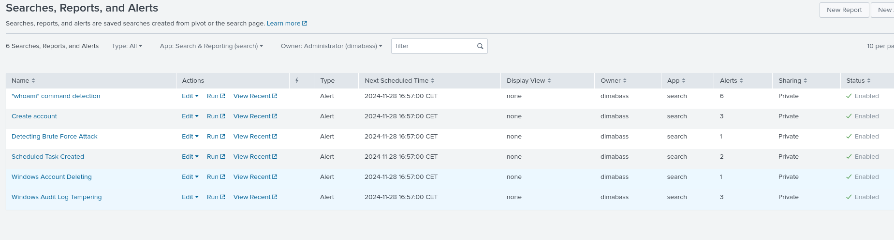

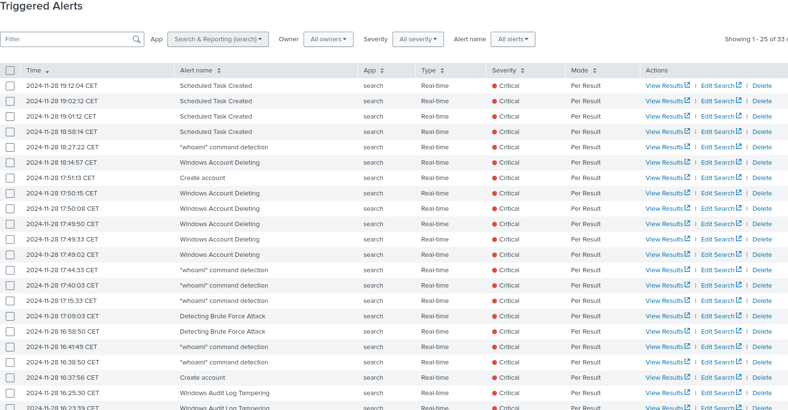
<div class="page-break"></div>
### **a. Alert: Windows Account Creation**

1. **Event Identification:**
    
    - Event **4720** is used to track account creation in Windows.
2. **Search Query:**

```spl
source="WinEventLog:*" index="windows_logs" EventCode=4720
```

   
3. **Alert Configuration:**

- Creating an alert is simple—just save the query as an alert. 
     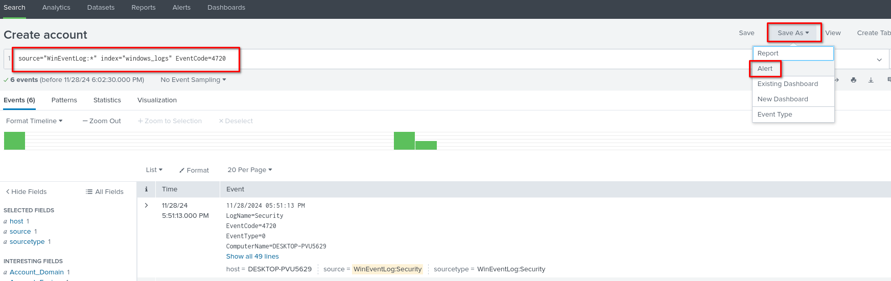
         
    - Set the trigger: **Trigger alert when number of results is greater than 0**.
    
- Configure actions (e.g., sending notifications to Slack, etc.).
    
    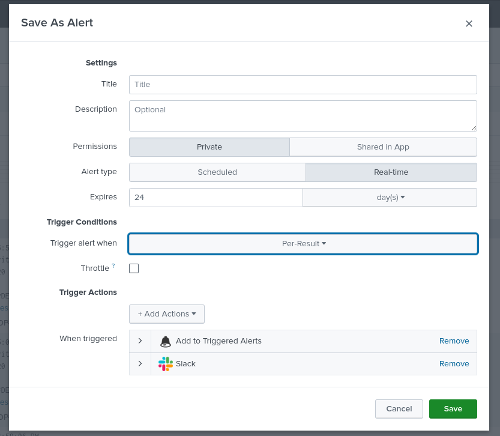

4. **Testing:**

- In Windows, create a new account via CMD:
```cmd
net user testacc P@ssw0rd /add
```
   
  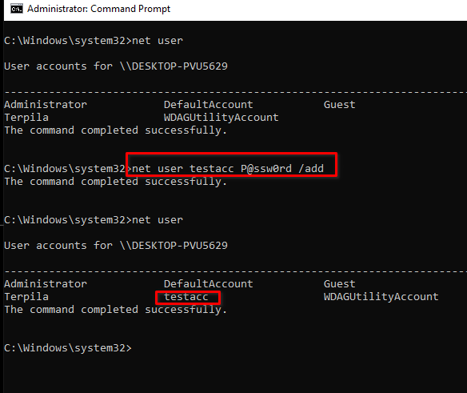
  
   Ensure the alert triggered successfully in Splunk and sent a notification.
   
   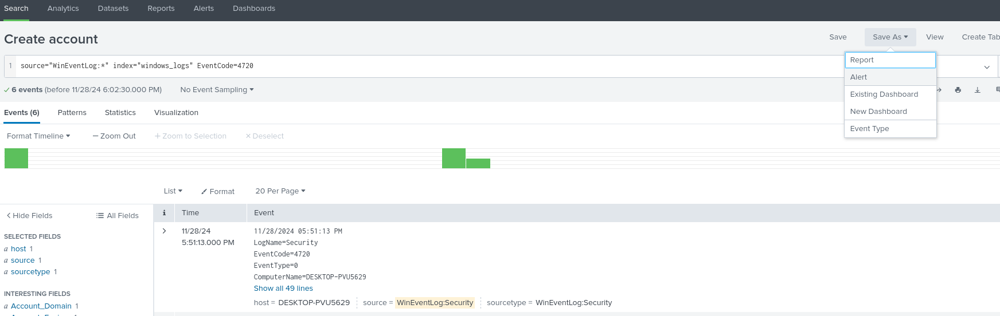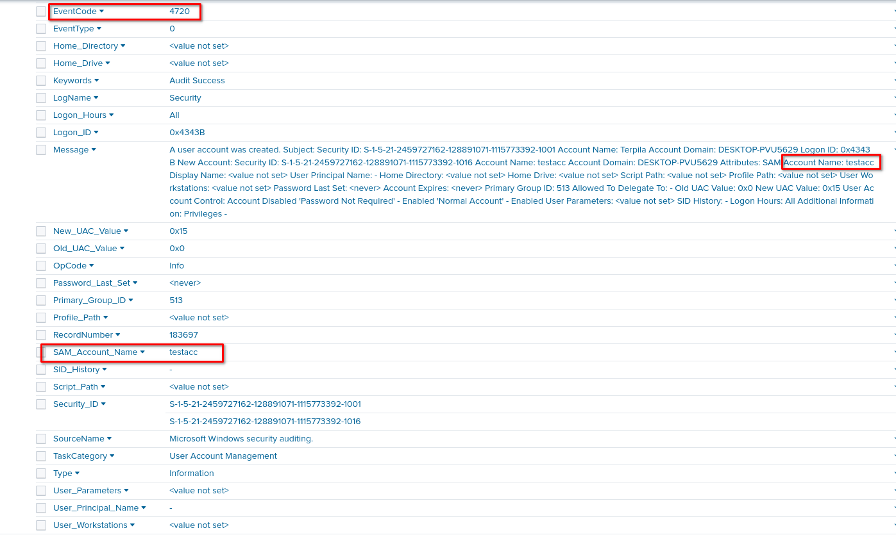

---

### **b. Alert: Windows Account Deletion**

1. **Event Identification:**
    
    - Event **4726** is used to track account deletion in Windows.
2. **Search Query:**
```spl
source="WinEventLog:*" index="windows_logs" EventCode=4726
```
   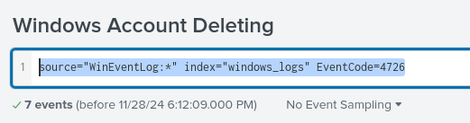
   
3. **Alert Configuration:** Same as in "a."
    
4. **Testing:**
    
    -Delete an account:
  ```cmd
net user testacc /delete
```
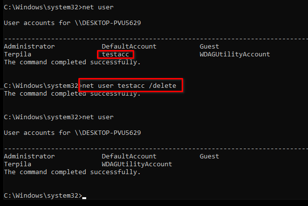
    - Verify the alert detected the deletion.
       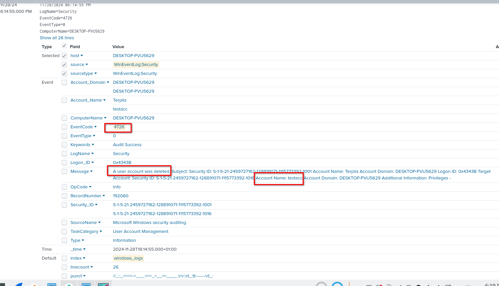
    

---

### **c. Alert: Audit Log Tampering**

1.  **Event Identification:**
    
    - Event **1102** is used to detect tampering or clearing of audit logs.
2.  **Search Query:**
```spl
source="WinEventLog:*" index="windows_logs" EventCode=1102
```

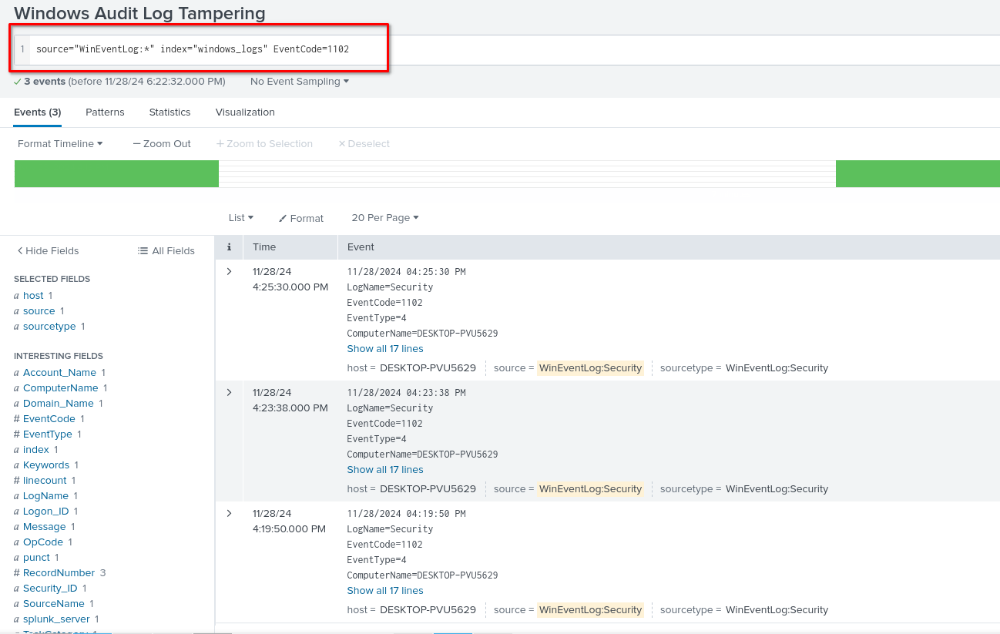
3. **Alert Configuration:** Same as previous cases.
    
4. **Testing:**
    
    - Clear the security log in Windows:
        
        `wevtutil cl Security`
        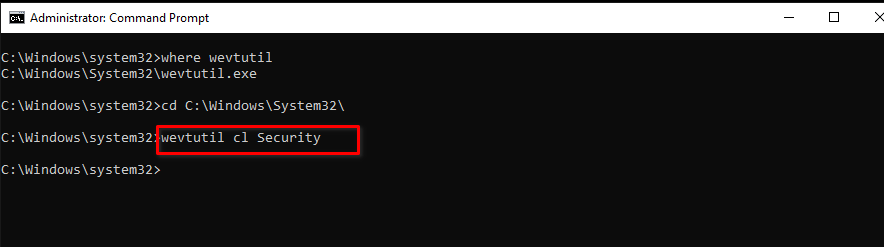
    - Verify the alert detected the activity.
    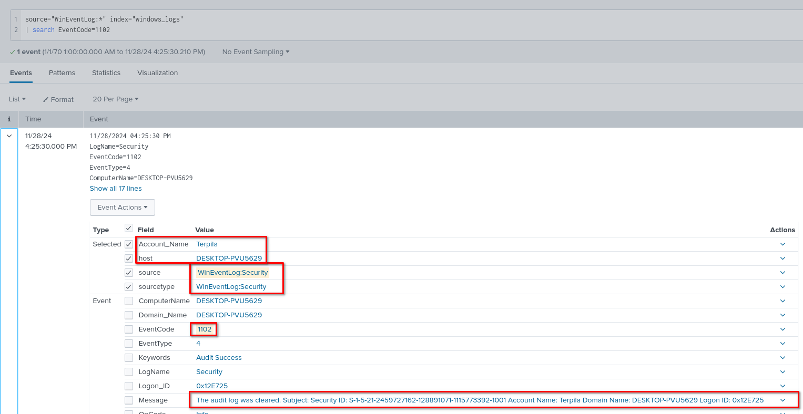

---

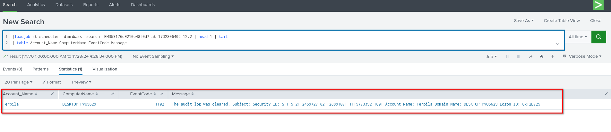

### **d. Alert: Detecting Brute Force Attacks**

1. **Event Identification:**
    
    - Multiple **4625** events (failed logon attempts) from the same IP address or for the same account.
2. **Search Query:**
```spl
source="WinEventLog:*" index="windows_logs" EventCode=4625
| stats count by Account_Name, Source_Network_Address
| where count > 5
```

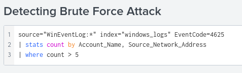
    
3. - **Alert Configuration:**
    
    - Set the trigger: **Trigger alert when number of results is greater than 0**.
4. **Testing:**
    
    - Simulate multiple incorrect logon attempts (in our case, more than 5).
        
    - Verify the alert detected suspicious activity.
    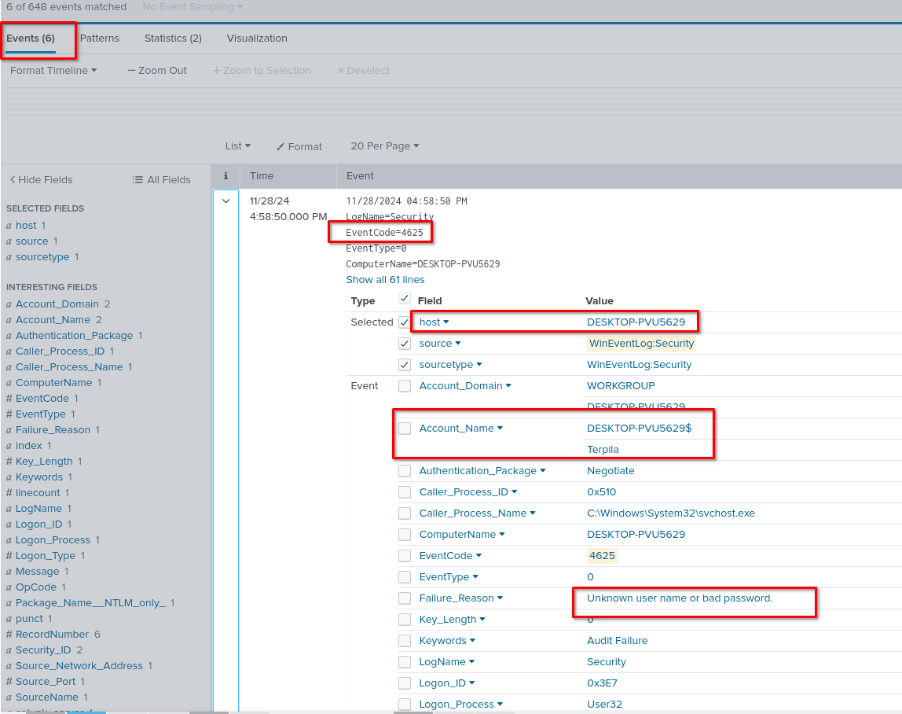
    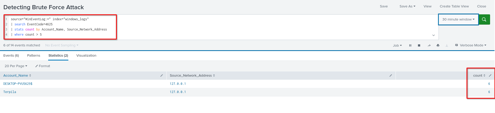
    
---

### **e. Alert: Detecting the Command "whoami"**

1. **Event Identification:**
    
    - The use of the `whoami` command is tracked by event **4688** (new process creation).
2. **Search Query:**
```spl
source="WinEventLog:*" index="windows_logs" EventCode=4688 New Process Name:"*whoami*"
```
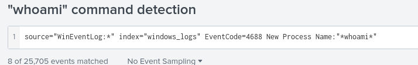

3.  - **Alert Configuration:** Same as previous cases.
    
4.  **Testing:**
    
    - Run the `whoami` command::
     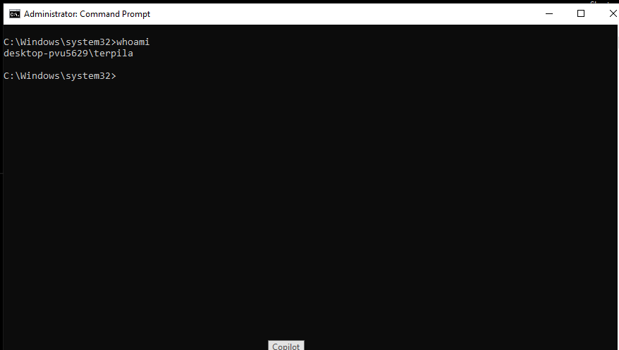  
    
    - Verify the alert detected the command execution.
    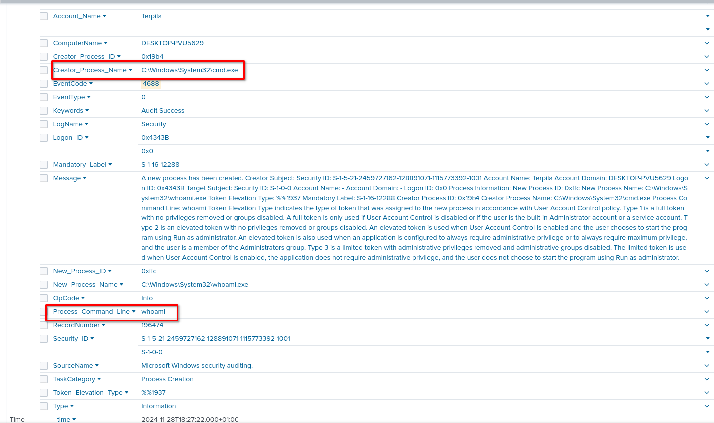
    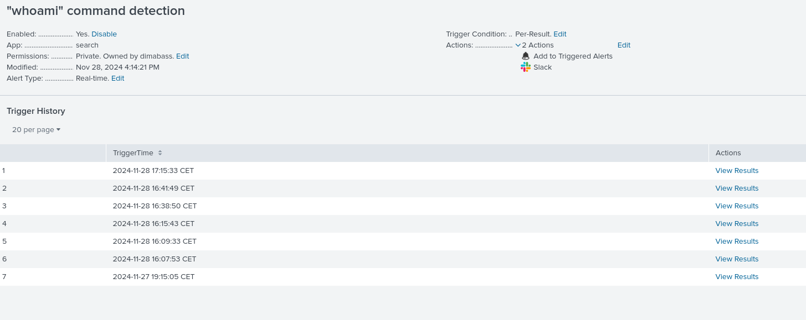
    
---

### **f. Alert: Scheduled Task Creation**

1. **Event Identification:**
    
    - Event **4698** is used to detect new scheduled tasks.
2. **Search Query:**
```spl
source="WinEventLog:*" index="windows_logs" EventCode=4698
```
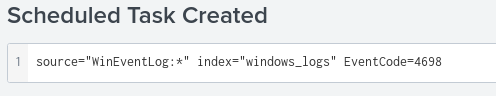

3. **Alert Configuration:** Same as previous cases.
    
4. **Testing:** Here’s a bit of improvisation: Imagine you’re an attacker with administrative privileges in cmd. Use the following commands to generate a `.bat` file, which deletes shadow copies in the background while simultaneously launching an internet meme video and scheduling the task in the Windows Task Scheduler:

```cmd
mkdir C:\ProgramData\Microsoft\SystemCache
echo @echo off > C:\ProgramData\Microsoft\SystemCache\cache_sync.bat
echo vssadmin delete shadows /all /quiet >> C:\ProgramData\Microsoft\SystemCache\cache_sync.bat
echo start "" "https://www.youtube.com/watch?v=dQw4w9WgXcQ" >> C:\ProgramData\Microsoft\SystemCache\cache_sync.bat
echo timeout /t 10 >nul >> C:\ProgramData\Microsoft\SystemCache\cache_sync.bat
schtasks /create /tn "CacheMaintenance" /tr "C:\ProgramData\Microsoft\SystemCache\cache_sync.bat" /sc onlogon /rl highest
```


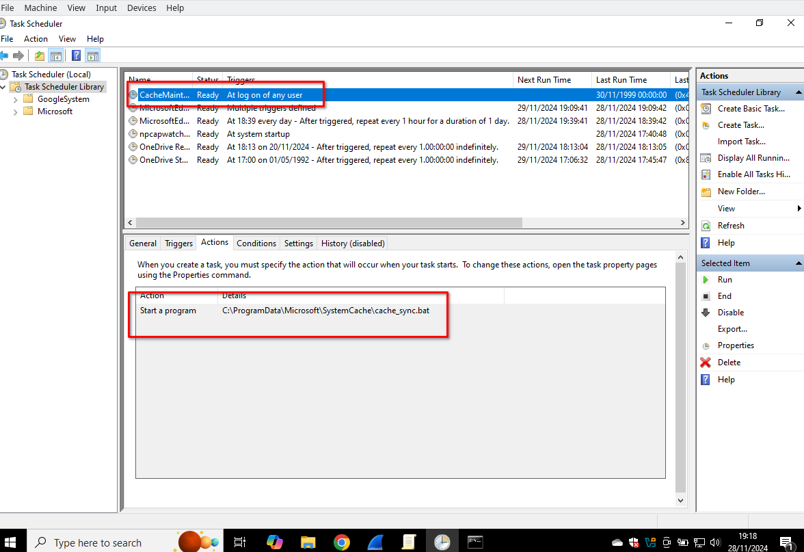

To manually run the task, execute:
```cmd
schtasks /run /tn "CacheMaintenance"
```
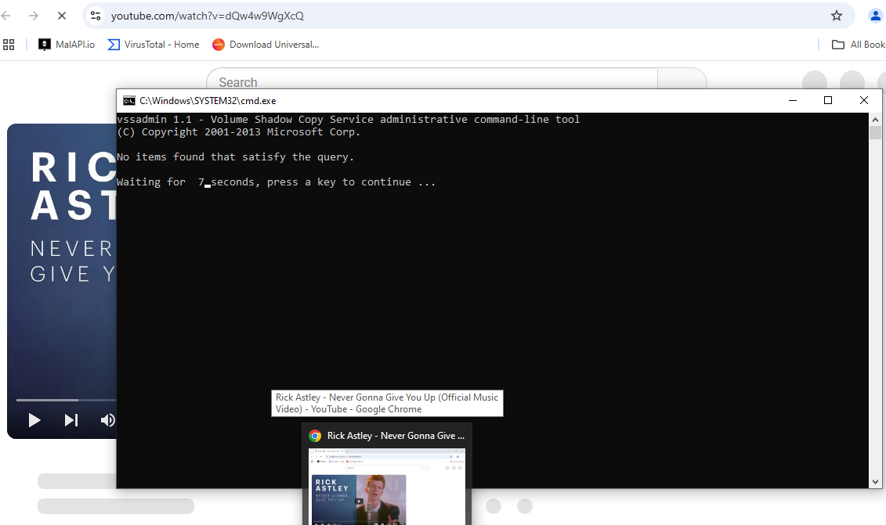`

   - Verify the alert detected the event.
   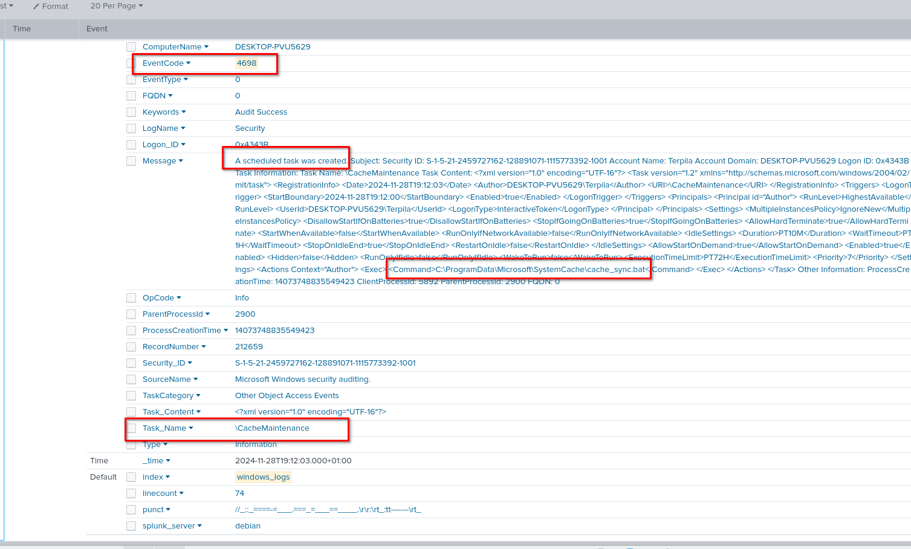

---

### **3. Integration with Slack (Optional)**

To make things easier, you can integrate Splunk with Slack:

- Install the **Slack App for Splunk** in Splunk.
    
- Configure the webhook in Slack.
    
- Link notifications from Splunk to the created alerts.
    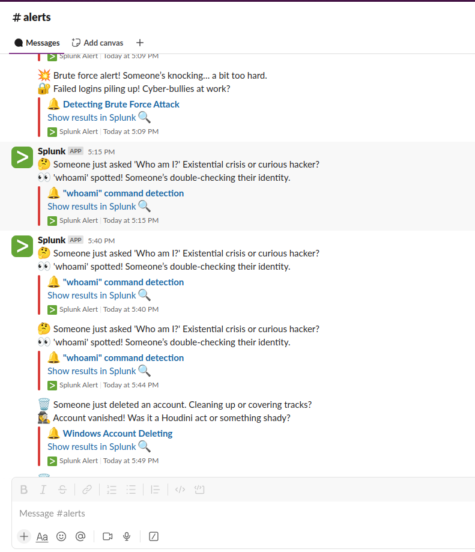
    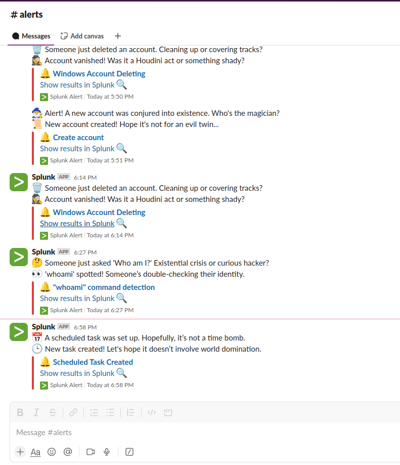
