> After a recent interview where I was challenged with analyzing a real-world AD attack, I dove deeper into advanced techniques and created this write-up. Full article reposted below for educational purposes.
---

Attacks on Microsoft Active Directory have been a recurrent topic of reports on Black Hat and Defcon during the last four years. Speakers tell about new vectors, share their inventions, and give recommendations on detection and avoidance of these vectors. I believe that the IT department is capable of creating a secure infrastructure, which can be monitored by the security department. High-quality monitoring, in its turn, requires good tools. That's like a military base: you have erected guard towers around the perimeter but still keep watch over the area.  
  

## Six strategies that would not be overlooked

Numerous vendors provide security software that supports monitoring of the following malicious activities:  
  

### Pass-the-Hash

This attack is conditioned by architecture of NTLM, an authentication protocol created by Microsoft in 1990s. Logging in to a remote host requires password hash stored on the computer that is used for the authentication process. Therefore, the hash can be extracted from that computer.  
  

### Mimikatz

To achieve that, a French researcher Benjamin Delpy developed in 2014 Mimikatz, the utility that allows dumping cleartext passwords and NTLM hashes from the computer memory.  
  

### Brute Force

If credentials extracted from one host are not enough, the attacker can opt for a rough but effective technique of guessing the password.  
  

### net user /domain

Where do we take a username dictionary to conduct this attack? Any domain member is allowed to execute the net user /domain command that returns a full list of AD domain users.  
  

### Kerberoasting

If a domain uses Kerberos as the authentication protocol, an attacker can try a Kerberoasting attack. Any user authenticated on the domain can request a Kerberos ticket for access to the service (Ticket Granting Service). TGS is encrypted with the password hash of the account used to run the service. The attacker who requested the TGS can now bruteforce it offline without any fear of being blocked. In case of success, the attacker gains the password to the account associated with the service, usually a privileged one.  
  

### PsExec

As soon as the attacker obtains the required credentials, the next task is remote command execution. This task can be easily solved using the PsExec utility from the Sysinternals set, which proved remarkably effective and is appreciated by both IT administrators and hackers.  
  

## Seven spells of hackers

Now we are going to review seven spells of hackers that can help to gain full control over Active Directory.  
  
[The figure shows four steps of the attack. Each step features a set of methods]  
  
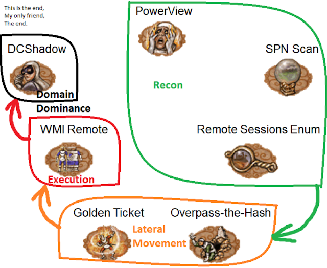
  
Let's start with reconnaissance.  
  

### PowerView

PowerView is a part of [PowerSploit](https://github.com/PowerShellMafia/PowerSploit), a well-known PowerShell framework for penetration testing. PowerView supports [Bloodhound](https://github.com/BloodHoundAD/BloodHound), the tool that gives graph representation of object connections in AD.  
  
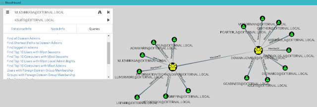
  
Graph representation of relationships between Active Directory objects  
Bloodhound immediately provides such possibilities as:  
  

- Finding accounts of all domain administrators
- Finding hosts, on which domain administrators are logged
- Finding [the shortest path](https://en.wikipedia.org/wiki/Shortest_path_problem) from the attacker's host to the host with the domain admin session

  
The last possibility replies to the question, what hosts need to be hacked to get to the domain admin account. This approach significantly reduces the time required for gaining full control over the domain.  
  
The difference between PowerView and built-in utilities that allow obtaining data on AD objects (such as net.exe) is that PowerView uses LDAP, not SAMR. To detect this activity, we can use domain controller event 1644. Logging of this event is enabled by adding the relevant value in the register:  
  
HKEY_LOCAL_MACHINE\SYSTEM\CurrentControlSet\Services\NTDS\Diagnostic\\15 Field Engineering = 5  
  

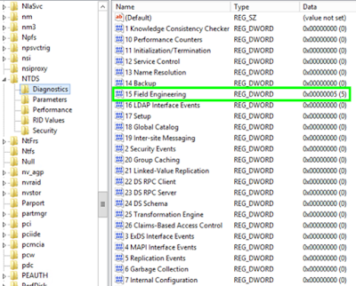

| Enabling logging of LDAP event 1644                                                                                                                                                                                           |
| ----------------------------------------------------------------------------------------------------------------------------------------------------------------------------------------------------------------------------- |

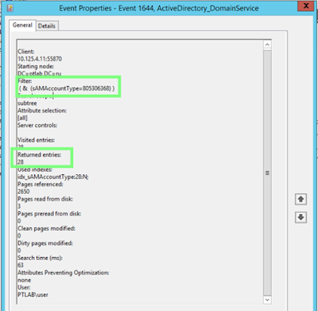

| Event 1644 with properties of an LDAP query                                                                                                                                                                                   |
| ----------------------------------------------------------------------------------------------------------------------------------------------------------------------------------------------------------------------------- |

  
  
Note that there can be multiple events of this kind, and a good alternative to analysis of events is analysis of traffic, because LDAP is a cleartext protocol and all queries are seen clearly in traffic.  
  
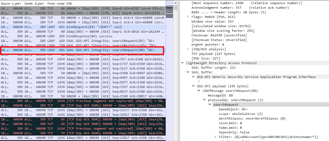

One more feature of the framework is that it uses only PowerShell and has no dependencies. Moreover, PowerShell v5 has a new option of advanced audit, which is very useful in detection. Event 4104 shows the script body, which can be searched for function names that are specific for PowerView.  
  

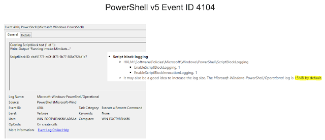

### SPN Scan

This utility can be a substitute for Nmap. As soon as a hacker knows what users and groups exist in AD, he or she needs information about services to get the whole picture.  
  

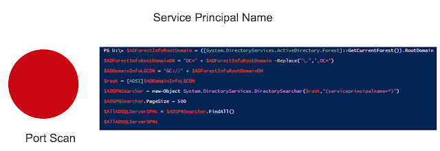
  
Commonly, scanning ports with Nmap provides this information. But now these data can be retrieved from AD—they are already stored there. The query result looks as follows: the reply returns an SPN (Service Principal Name) that consists of a service class, which is unique for each service type, host name in FQDN format, and port for some services.  
  

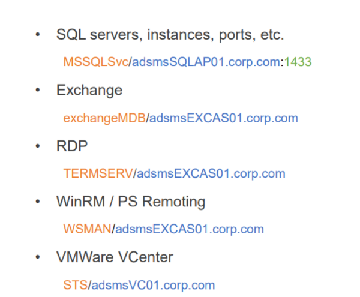

For the full list of SPNs, see [https://adsecurity.org/?page_id=183](https://adsecurity.org/?page_id=183)  
  
To detect SPN Scan, audit of LDAP events can be used.  
  
SPN Scan has a clear advantage over Nmap: it is less noisy. When you use Nmap, you need to connect to each host and send packets to the range of ports specified by you, whereas the SPN list is a consequence of only one query.  
  

### Remote Sessions Enumeration

During the phase that is called lateral movement, an important task is to match users with computers they are logged on: the attacker either already has the user credentials (hash or a Kerberos ticket) and searches for hosts to log in flawlessly, or searches for the host with a session of the domain administrator.  
  
Both cases trigger the following scenario: hunt –> compromise any host –> upload Mimikatz – > profit.  
  
To detect the use of this scenario, two events can be used: 4624—a successful logon to a remote system (logon type 3), and events of access to the network share IPC$, with one nuance, the named pipe "srvsvc". Why the pipe is named like this can be guessed from the traffic.  
  
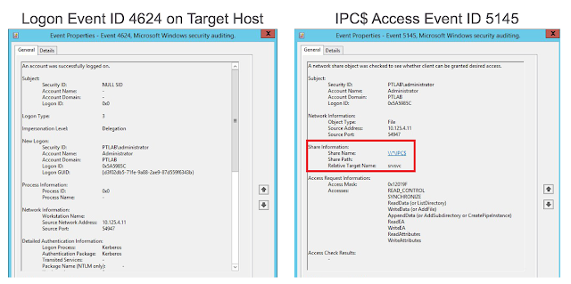
  
Red boxes in the left part show SMB connections, and then connections to the pipe "srvsvc". This pipe allows interacting via the Server Service Remote Protocol. End hosts receive various administrative information from the pipe; for example, one of the requests is NetSessEnum. This request returns a full list of users logged in to the remote system with their IP addresses and names.  
  
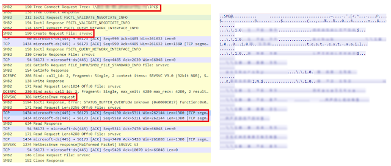

  
MaxPatrol SIEM allows detection based on correlation of these two events with srvsvc taken into account. PT Network Attack Discovery performs similar detection based on traffic analysis.  
  

### Overpass-the-Hash

Pass-the-Hash reincarnation. Let's continue with lateral movement. What an attacker can do with NTLM hash on hand? Conduct a Pass-the-Hash attack. But it is already well-known and can be detected. Therefore, a new attack vector—Overpass-the-Hash—has been found.  
  
The Kerberos protocol was developed specifically to prevent sending user passwords over the network in any form. To avoid that, the user encrypts an authentication request using password hash on its own computer. A Key Distribution Center (a special service running on the domain controller) replies with a ticket to get other tickets, the so-called Ticket-Granting Ticket (TGT). Now the client is deemed authenticated and can request tickets to access other services within the next 10 hours. Therefore, if the attacker dumps hash of a user who is a member of a trusted group of the target service (for example, ERP system or database), the attacker can issue a ticket for itself and successfully log in to the target service.  
  
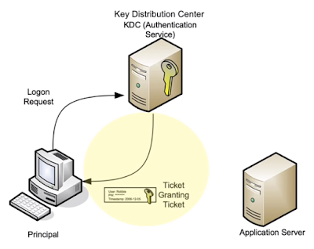

#### How to detect

If a hacker uses the PowerShell version of Mimikatz for an attack, logging the script body would help, because Invoke-Mimikatz is quite an indicative line.  
  
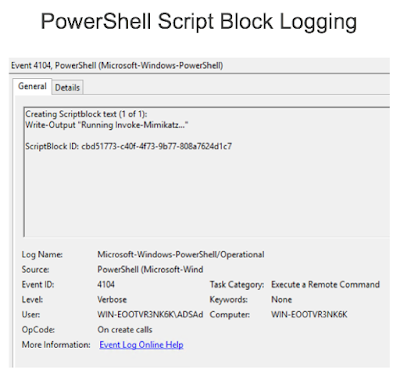
  
Another symptom is event 4688—creating a process with extended audit of the command line. Even if a binary file is renamed, the command line would contain the command, which is very peculiar to Mimikatz.  
  

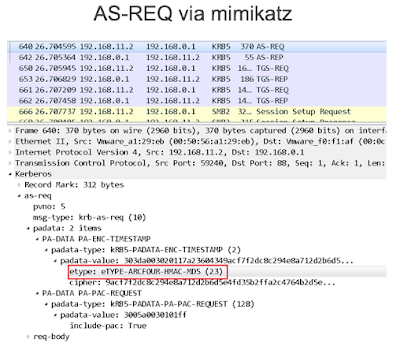

  
  
If you want to detect an Overpass-the-Hash attack by analyzing traffic, the following anomaly can be used: Microsoft recommends using AES256 encryption for authentication requests in modern domains, and if Mimikatz sends authentication request data, it encrypts the data with an outdated ARCFOUR.  
  

  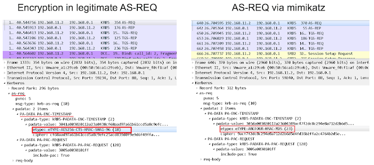
  
Another specific feature is the cipher suite sent by Mimikatz, which is different from a legitimate domain's suite, and thus stands out in the traffic.  
  

### Golden Ticket

A well-known method.  
  
What can an attacker get out of password hash of a special account called krbtgt? Previously, we reviewed a case where the user could be unprivileged. Now, we review a case where the user's password hash is used for signing absolutely all tickets for gaining other tickets (TGT). There is no need to address to a Key Distribution Center: an attacker can generate this ticket, because a Golden Ticket is in fact a TGT. Then the attacker can send authentication requests on any service in AD for an unlimited period. The result is unrestricted access to target resources—Golden Ticket has its name for a reason.  
  
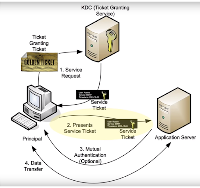
  

#### How to detect based on events 

Event 4768 informs that a TGT was granted, and event 4769 informs that a service ticket required for authentication on some service in AD was granted.  
  
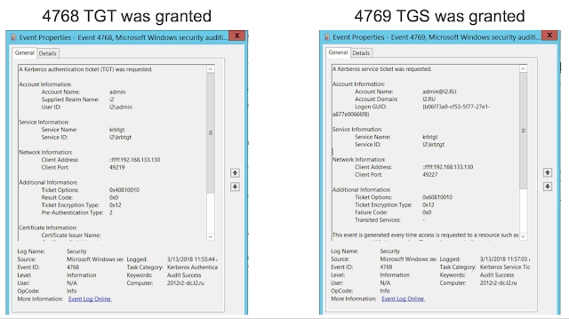
  
In this case, we can speculate in difference: while Golden Ticket does not request a TGT from the domain controller (because it generates the TGT itself), it has to request a TGS. Therefore, if we see that obtained TGT and TGS differ, we can assume that the Golden Ticket attack is underway.  
MaxPatrol SIEM uses table lists to log all issued TGTs and TGSs to implement this method of detection.  
  

### WMI Remote Execution

After being authenticated and authorized on target hosts, the hacker can start remote execution of tasks. WMI is a built-in mechanism that fits perfectly for this purpose. For the last few years, living off the land is on trend, which means using built-in Windows mechanisms. The main reason is the ability to mimic legitimate activities.  
  
The figure below demonstrates the use of wmic, a built-in utility. The utility is given a host address for connection, credentials, the process call create operator, and a command to be executed on the remote host.  
  

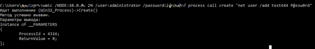

#### How to detect 

Check the combination of remote logon events 4624. An important parameter is the Logon ID. Also check event 4688 that informs about creating a process with the command line. Event 4688 shows that the parent of the created process is WmiPrvSE.exe, a special wmi service process used for remote administration. We can see the command net user /add sent by us, and the Logon ID, which is the same as in event 4624. Thus, we can tell absolutely precisely from which host this command was initiated.  
  
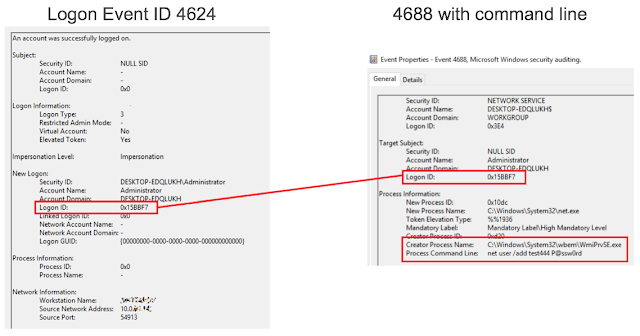
#### Detection based on traffic analysis

We can clearly see words typical of Win32 process create, and the command line, which is going to be executed. The malware on the figure below was distributed on virtual networks in the same way as WannaCry, but instead of encryption, it set up a crypto miner. The malware used Mimikatz and EthernalBlue, dumped accounts, and used them to log in to hosts it could reach on the network. Using WMI, the malware ran PowerShell on these hosts and downloaded PowerShell payload, which also contained Mimikatz, EthernalBlue, and a miner. Thus, a chain reaction was created.  

  

  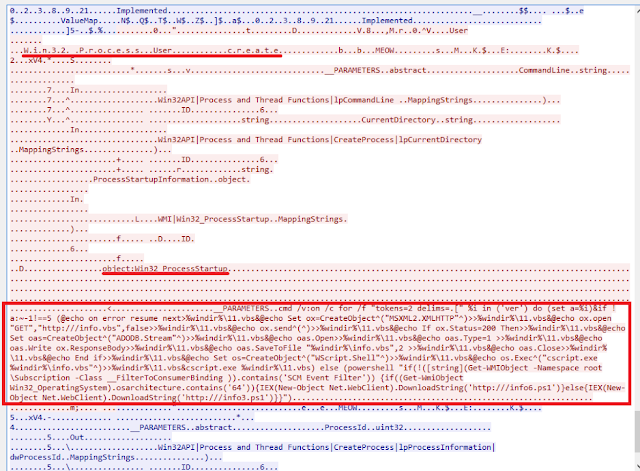
  
Recommendations  
  

1. **Use complex and long passwords (at least 25 symbols)** **for service accounts**. An attacker would not have any chance to conduct a Kerberoasting attack, because it takes too much time to bruteforce such passwords. 
2. **Enable PowerShell logging**. This would help to reveal the use of various modern tools for attacks on AD. 
3. **Upgrade to Windows 10 and Windows Server 201**6.  Microsoft created Credential Guard: it prevents dumping of NTLM hashes and Kerberos tickets. 
4. **Implement role-based access control**. It is risky to assign permissions of AD, DC, server, and workstation admins to one role. 
5. **Reset the krbtgt (account used for signing TGT) password twice every year and every time the AD administrator changes**. It is important to change the password twice, because the current and the previous passwords are stored. Even if a network is compromised and attackers issued a Golden Ticket, changing the password makes this Ticket useless, and they have to bruteforce the password once again. 
6. **Use protection tools with a continuously updating expert database**. This helps revealing current ongoing attacks.

  

### DCShadow

  
On January 24, 2018, Benjamin Delpy and Vincent Le Toux released during the Microsoft BlueHat in Israel a new Mimikatz module that implements the DCShadow attack. The idea of the attack is to create a rogue domain controller to replicate objects in AD. The researchers defined a minimum set of Kerberos SPNs required for successful replication—only two SPNs are required. They also showed a special function that can start forced replication of controllers. The authors assure that this attack can make your SIEM go blind. A rouge domain controller would not send events to SIEM, which means that attackers can do various evil tricks with AD and SIEM, and nobody would know about that.  
  
The attack scheme:  
  
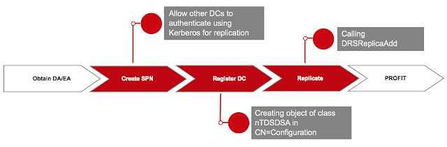
  
Two SPNs should be added to the system the attack is run from. These SPNs are required for other domain controllers to authenticate using Kerberos for replication. Because the domain controller is represented as the object of class nTDSDSA in the AD base according to the specification, such an object should be created. Finally, replication is triggered by the DRSReplicaAdd function.  
  

#### How to detect 

This is what DCShadow looks like in traffic. By analyzing the traffic, we can clearly see that a new object is added to the domain controller configuration scheme, and then replication is triggered.  
  
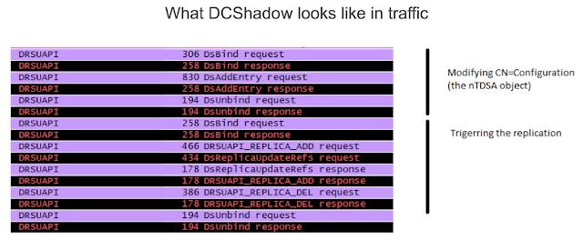
  
Although the attack creators say that SIEM would not help in its detection, we found a way to inform the security department about suspicious activity on the network.  
  
Our correlation has a list of legitimate domain controllers, and it would be triggered at every replication from a domain controller, which not included into this whitelist. Therefore, the security department can conduct an investigation to check if that is a legitimate domain controller added by the IT service, or a DCShadow attack.  
  
An example of DCShadow confirms that new enterprise attack vectors appear. It is essential to stay on the crest of the wave in this ocean of information security, look ahead, and act quickly.  
  
Every day, we at PT Expert Security Center research new threats and develop methods and tools to detect them. And we'll continue sharing this information with you

---

## 📎 Disclaimer & Attribution

> **Disclaimer**: This article was originally written by a security researcher at Positive Technologies and was published in 2018.  
> The content is reposted here strictly for educational and non-commercial purposes.  
>  
> 📄 **Source (archived translation)**: [Malware.News](https://malware.news/t/advanced-attacks-on-microsoft-active-directory-detection-and-mitigation/23501)  
> ✍️ **Original Author**: Security Researcher from Positive Technologies
