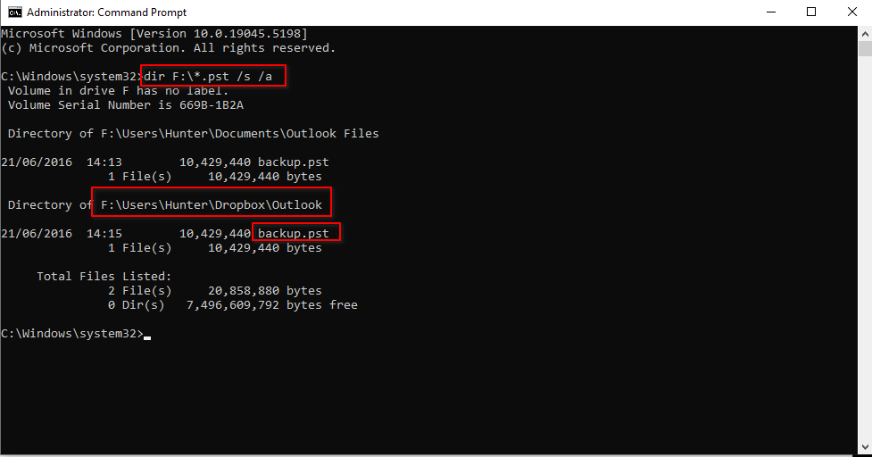
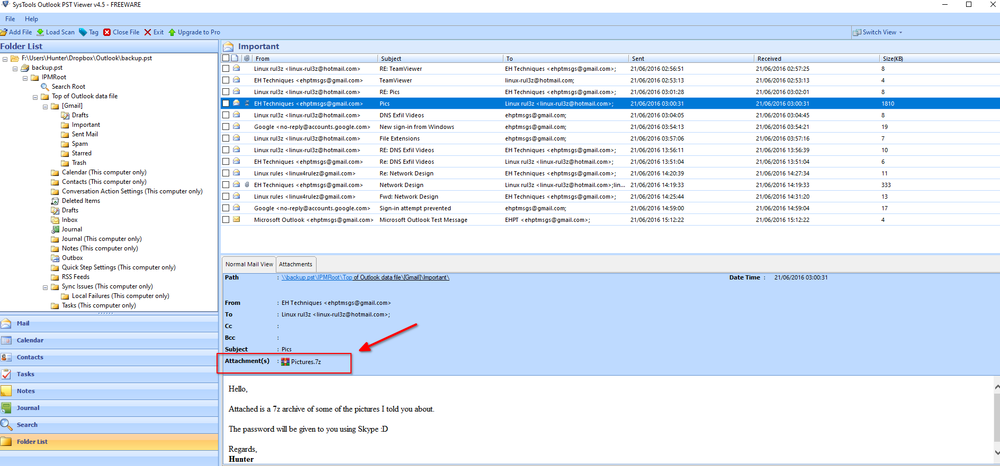
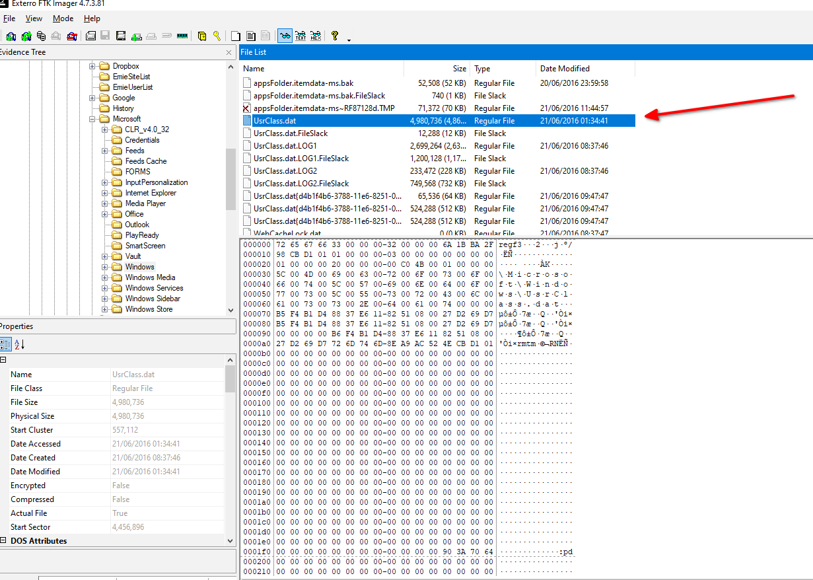
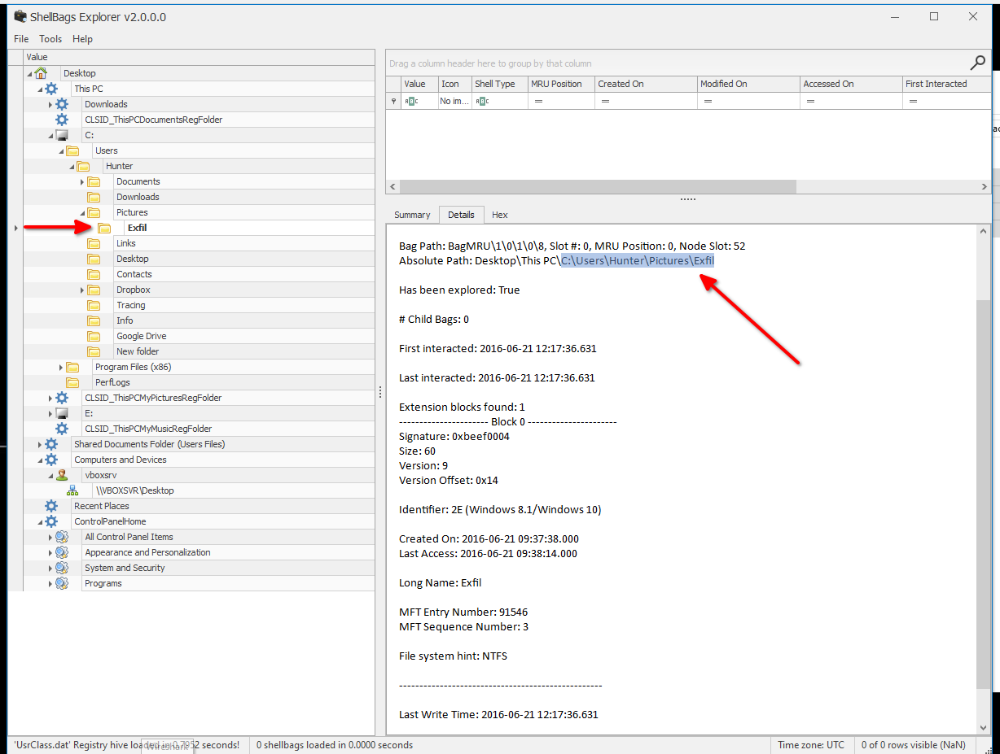
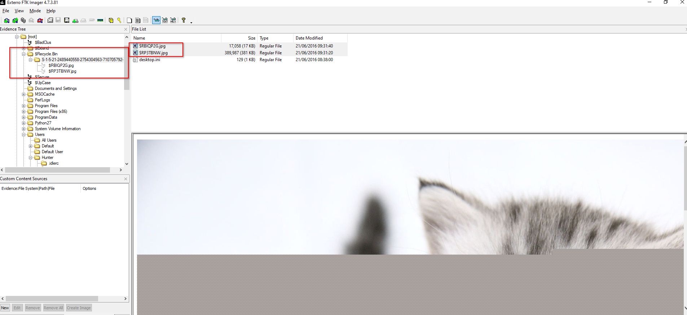
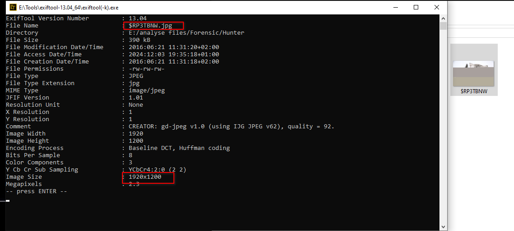
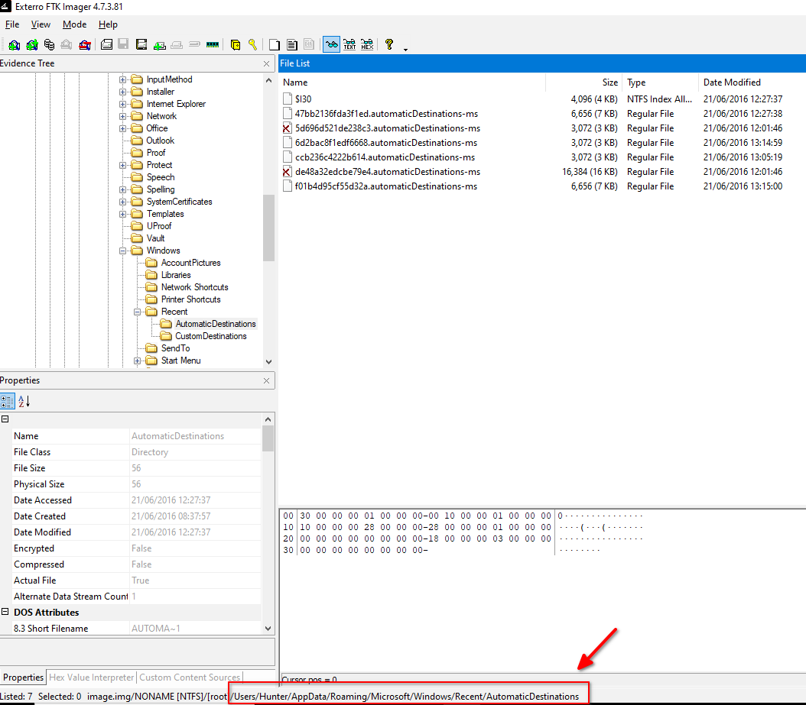

 
 Q -21 The suspicious employee tried to infiltrate the data by sending it as an email attachment. What is the name of the suspicious attachment?
 **Answer: Pictures.7z**

I locate the Outlook PST file and export it.

For this, I use a PST viewer tool. I specifically search for emails containing `.7z` attachments.

Q - 22: What is the PATH of the directory created to leak data?
**Answer: C:\Users\Hunter\Pictures\Exfil**

Next, I extract ShellBags data from the **UsrClass.dat** file. After obtaining the file, I analyze it using **ShellBags Explorer**.

Within the `Hunter` user folder, I identify key subfolders of interest.

Q - 23:The user deleted two JPG files from the system and moved them to $Recycle-Bin. What is the file name with a resolution of 1920x1200?!
**Answer:  $RP3TBNW.jpg**

I then examine the Recycle Bin to uncover additional traces.

Next, I use the Exiftool utility to extract metadata.

Q -24 : What is the name of the directory where information about JumpList items (automatically generated by the system) is stored?
**Answer: AppData\Roaming\Microsoft\Windows\Recent\AutomaticDestinations**

To retrieve **Automatic Destinations**, I perform a quick search online, which provides the necessary information. I also review the *CustomDestinations*, which will be useful later.

Q -25 : Using JUMP LIST analysis, provide the full path of the application with APP-ID "aa28770954eaeaaa" used to circumvent network security monitoring controls.
**Answer: C:\Users\Hunter\Desktop\Tor Browser\Browser\firefox.exe**

I navigate to the **CustomDestinations** directory and extract the relevant Jump List mentioned in the task.

Finally, I use **JumpList Explorer** to open the file and reveal the full path

---
